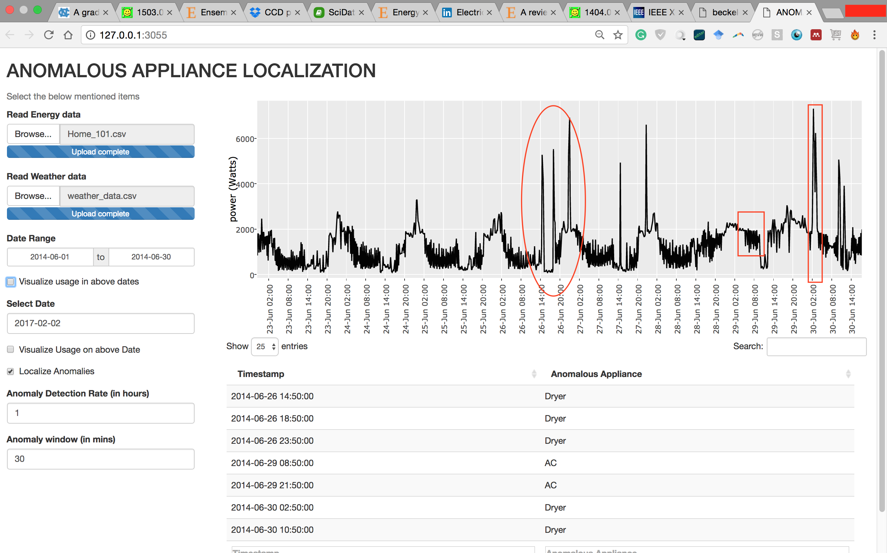

# AnomAppliance
This repository contains the R code of proposed anomalous appliance identifcation approach. The code is formatted in the form of an R shiny application, ready to deploy on R server.
## Requirements
1. Install R framework on the system
2. Install following R packages: data.table, xts, ggplot2, gtools, shiny, fasttime, scales and cluster

## Instructions
1. Download files ui.R, server.R, and support_functions.R
2. Run ui.R on terminal
3. Running ui.R will start R server on your machine and the application will open in a new window of your web browser automatically
4. The web page displayed will be like as shown below

5. Input two mentioned files 1) A csv file containing power readings and, 2) Another csv file containing weather data

## Contact

Please email to XXX for issues